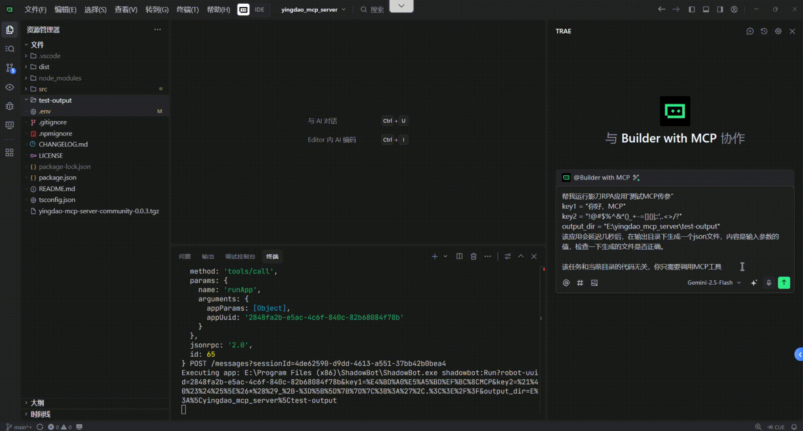

# Yingdao MCP Server (Community)

[](https://www.npmjs.com/package/yingdao-mcp-server-community) [](https://www.npmjs.com/package/yingdao-mcp-server-community) [](https://nodejs.org/)  
[](https://github.com/scoooooott/yingdao_mcp_server/releases) [](https://github.com/scoooooott/yingdao_mcp_server/commits/main) [](https://github.com/scoooooott/yingdao_mcp_server)

社区维护的影刀 RPA MCP Server，支持两种运行模式：STDIO 与 SSE/HTTP。相比原仓库，提供更易用的安装与分发（npm/tgz）、更完整的工具与参数支持，并保持与 MCP 客户端的良好集成。

## 特性展示
- 支持 STDIO 与 SSE/HTTP 两种运行模式。
- 更易安装与分发：npm / tgz 可选。
- 与 MCP 客户端良好集成（如 Claude Desktop）。
- 完整工具与参数支持，覆盖应用查询、参数获取、任务启动与结果查询等。

- 多语言支持：`LANGUAGE`（默认 `zh`）。
- 运行环境：Node.js `>= 18`。

## 功能说明

### 本地模式（local）
- 依赖参数：`SHADOWBOT_PATH`、`USER_FOLDER`。
- 支持能力：
  - `queryApplist`：查询应用列表。
  - `queryRobotParam`：查询应用参数。
  - `runApp`：启动应用并传参（目前仅部分 Windows 环境支持传参，macOS 暂不支持）。
- 典型场景：直接调用本机影刀客户端，低延迟，适合单机使用。

### 开放 API 模式（openapi）
- 依赖参数：`ACCESS_KEY_ID`、`ACCESS_KEY_SECRET`。
- 支持能力：
  - `queryApplist`：查询应用列表。
  - `queryRobotParam`：查询应用参数。
  - `uploadFile`：上传文件。
  - `startJob`：启动应用任务（支持对象参数自动转换）。
  - `queryJob`：查询任务执行结果。
  - `queryClientList`：查询调度 RPA 机器人列表。
- 典型场景：通过服务端或远程接口调用，适合跨进程/跨网络场景。

## 快速启动
1. 准备需要的参数：
   - 本地模式：
     - `SHADOWBOT_PATH`
       - Windows（示例）：`E:\Program Files\ShadowBot\ShadowBot.exe`
       - MacOS（示例）：`/Applications/影刀.app`
     - `USER_FOLDER`: 用户文件夹路径（[在影刀设置中查看](#路径与示意)）
   - 开放 API 模式：
     - `ACCESS_KEY_ID`：影刀控制台获取
     - `ACCESS_KEY_SECRET`：影刀控制台获取
2. 选择运行模式：STDIO（推荐）或 SSE/HTTP。
3. 启动并配置 MCP 客户端：
   - STDIO：在 `mcpServers` 中设置 `command`/`args` 与 `env`。
   - SSE/HTTP：先启动本地服务，再在 `mcpServers` 使用 `type: "sse"` 与 `url`。

## 详细信息

### 环境变量说明
- `LANGUAGE`：多语言（默认 `zh`），如 `en`。
- `RPA_MODEL`：运行模式（默认 `local`）。
  - `local`：需要 `SHADOWBOT_PATH` 与 `USER_FOLDER`。
  - `openapi`：需要 `ACCESS_KEY_ID` 与 `ACCESS_KEY_SECRET`。
- `SHADOWBOT_PATH`：影刀客户端路径（macOS 下可能为 `ShadowBot.app` 或 `影刀.app`，以本机实际为准）。
- `USER_FOLDER`：影刀用户目录（用于定位 `apps/` 及日志）。
- `ACCESS_KEY_ID` / `ACCESS_KEY_SECRET`：开放 API 访问凭据。
- `SERVER_PORT`：SSE/HTTP 服务端口（默认 3000）。

### 配置示例

#### STDIO 模式
```json
// macos
{
  "mcpServers": {
    "yingdao": {
      "command": "npx",
      "args": ["yingdao-mcp-server-community"],
      "env": {
        "LANGUAGE": "zh",
        "RPA_MODEL": "local",
        "SHADOWBOT_PATH": "/Applications/Shadowbot.app",
        "USER_FOLDER": "/Users/<you>/Library/Application Support/Shadowbot/user/<用户id>"
      }
    }
  }
}
```

#### SSE/HTTP 模式
- 安装：`npm i -g yingdao-mcp-server-community`
- 启动：
  - 本地模式（示例）：`RPA_MODEL=local SHADOWBOT_PATH="/Applications/Shadowbot.app" USER_FOLDER="/Users/<you>/Library/Application Support/Shadowbot/user/{用户id}" yingdao-mcp-server-community --server`
  - 开放 API 模式（示例）：`RPA_MODEL=openapi ACCESS_KEY_ID="<id>" ACCESS_KEY_SECRET="<secret>" SERVER_PORT=3000 yingdao-mcp-server-community --server`
- MCP 客户端配置：
```json
{
  "mcpServers": {
    "yingdao": {
      "type": "sse",
      "url": "http://localhost:3000/sse",
      "autoReconnect": true,
      "retryLimit": null
    }
  }
}
```

### 路径与示意
<p></p>


原仓库：https://github.com/ying-dao/yingdao_mcp_server
许可证：`MIT`
